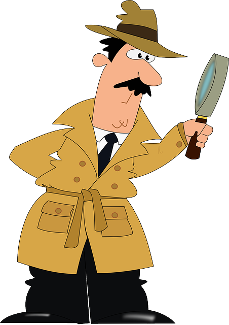

[](https://pixabay.com/vectors/detective-investigation-man-police-311684)

# gadget - Assertion library for go

[](https://github.com/4rcode/gadget/actions/workflows/go.yml)
[](https://codecov.io/gh/4rcode/gadget)
[](https://pkg.go.dev/github.com/4rcode/gadget)

## Installation

```
go get github.com/4rcode/gadget
```

## [Examples](howto_test.go)

## License

```
This Source Code Form is subject to the terms of the Mozilla Public
License, v. 2.0. If a copy of the MPL was not distributed with this
file, You can obtain one at http://mozilla.org/MPL/2.0/.
```
